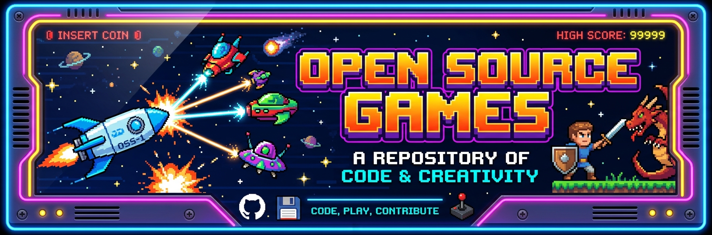
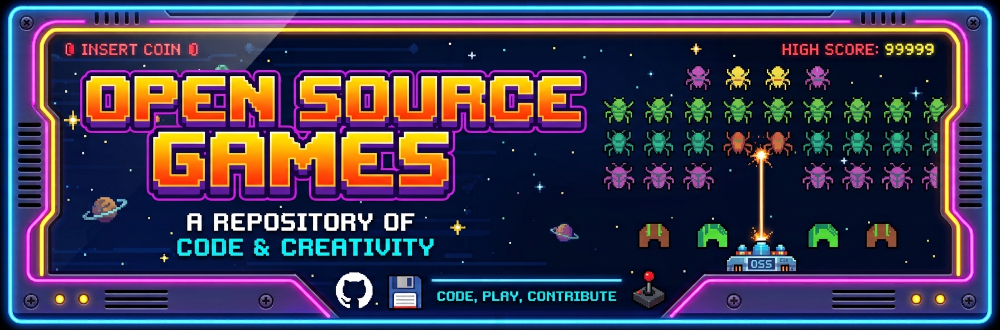

# Open-Source-Games
Appimage version of games.

---

There are some games that are hard to find in AppImage format, which I like. There are also some that are tricky to compile or install because they’re old and have been abandoned. With the help of AI, I’ve compiled and packaged the ones I found most interesting in AppImage format.

---

Games included so far:

* Angry_Drunken_Dwarves-x86_64.AppImage          [Official website](https://sourceforge.net/projects/archiveapp-game/files/a/angrydd/)

* AstroMenace-x86_64.AppImage                    [Official website](https://github.com/viewizard/astromenace)

* Berusky-i686.AppImage                          [Official website](https://anakreon.cz/berusky1.html)

* BlockOut_II-x86_64.AppImage                    [Official website](http://www.blockout.net/blockout2)

* Bomberclone-x86_64.AppImage                    [Official website](https://github.com/promi/bomberclone)

* Briquolo-x86_64.AppImage                       [Official website](http://briquolo.free.fr/en/infos.html)

* CuteMaze-x86_64.AppImage                       [Official website](https://gottcode.org/cutemaze)

* Enigma-x86_64.AppImage                         [Official website](https://www.nongnu.org/enigma)

* Extreme_Tux_Racer-x86_64.AppImage              [Official website](https://sourceforge.net/projects/extremetuxracer)

* FiveOrMore-x86_64.AppImage                     [Official website](https://gitlab.gnome.org/GNOME/five-or-more)

* Four-in-a-Row-x86_64.AppImage                  [Official website](https://gitlab.gnome.org/GNOME/four-in-a-row)

* Frozen_Bubble-x86_64.AppImage                  [Official website](https://github.com/kthakore/frozen-bubble)

* GNURobbo-i686.AppImage                         [Official website](https://gnurobbo.sourceforge.net)

* GPlanarity-i686.AppImage                       [Official website](https://web.mit.edu/xiphmont/Public/gPlanarity.html)

* Gweled-x86_64.AppImage                         [Official website](https://gweled.org)

* KMahjongg-x86_64.AppImage                      [Official website](https://apps.kde.org/es/kmahjongg)

* Kobo_Deluxe-x86_64.AppImage                    [Official website](https://olofson.net/kobodl)

* Mr.Boom-x86_64.AppImage                        [Official website](https://github.com/Javanaise/mrboom-libretro)

* Neverball-x86_64.AppImage                      [Official website](https://github.com/Neverball/neverball)

* Open_Sonic-i686.AppImage                       [Official website](https://opensnc.sourceforge.net/home/index.php)

* OpenTyrian-x86_64.AppImage                     [Official website](https://github.com/opentyrian/opentyrian)

* Pathological-x86_64.AppImage                   [Official website](https://sourceforge.net/projects/pathological)

* Pingus-x86_64.AppImage                         [Official website](https://pingus.seul.org)

* Powermanga-x86_64.AppImage                     [Official website](https://github.com/brunonymous/Powermanga)

* Reversi-x86_64.AppImage                        [Official website](https://gitlab.gnome.org/GNOME/iagno)

* Ri-li-x86_64.AppImage                          [Official website](https://ri-li.sourceforge.net/index.html)

* Secret-Maryo-Chronicles-i686.AppImage          [Official website](http://www.secretmaryo.org)

* Solitario_Aislerot-x86_64.AppImage             [Official website](https://gitlab.gnome.org/GNOME/aisleriot)

* Sonic_Robo_Blast_2-x86_64.Appimage             [Official website](https://github.com/STJr/SRB2)

* SRB2Kart-x86_64.AppImage                       [Official website](https://github.com/STJr/Kart-Public)

* Starfighter-x86_64.AppImage                    [Official website](https://github.com/pr-starfighter/starfighter)

* Sudoku-x86_64.AppImage                         [Official website](https://github.com/sepehr-rs/Sudoku)

* Super_Tux_Advance-x86_64.AppImage              [Official website](https://github.com/kelvinshadewing/supertux-advance)

* SuperTuxKart-x86_64.AppImage                   [Official website](https://github.com/supertuxkart/stk-code)

* Taisei_Project-x86_64.AppImage                 [Official website](https://github.com/taisei-project/taisei)

* TecnoballZ-x86_64.AppImage                     [Official website](https://github.com/brunonymous/tecnoballz)

* TileWorld-x86_64.AppImage                      [Official website](https://www.muppetlabs.com/~breadbox/software/tworld)

* TileWorld2-x86_64.AppImage                     [Official website](https://tw2.bitbusters.club)

* TripFunnyBoat-x86_64.AppImage                  [Official website](https://funnyboat.sourceforge.net/index.html)

* Turres_Monacorum-x86_64.AppImage               [Official website](https://github.com/nczempin/Turres-Monacorum)

* Whichwayisup-x86_64.AppImage                   [Official website](https://salsa.debian.org/games-team/whichwayisup)

* Wizznic-x86_64.AppImage                        [Official website](https://sourceforge.net/projects/wizznic)

* XGalaga-x86_64.AppImage                        [Official website](https://sourceforge.net/projects/xgalaga/)

---

Games:                                           https://github.com/Uthopik/Open-Source-Games/releases/tag/v1.0

---

If there’s an old game or programme you’d like to see in this collection, let me know and I’ll see what I can do. Just make sure it’s open source.

email: josearrillaga@ik.me
